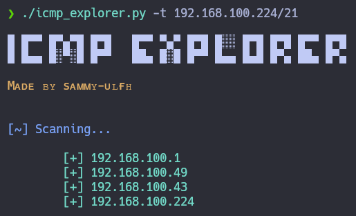

# icmp_explorer

<p align="center">
    
</p>

**ICMP Explorer** is a tool to scan up hosts in your local network by ICMP Protocol. You just need to specify your ipv4 with the correct bitmask with **-t** argument.

<p align="center">
    
</p>

## What I need to run it?

1. First, you need to clone the repository:

    ```git
    git clone https://github.com/sammy-ulfh/icmp_explorer.git
    ```

2. Second, you need to go to **icmp_explorer/script** directory.

3. Third, you need to install the required libraries using pip:

    ```pip3
    pip3 install -r requirements.txt
    ```

## How can I use it?

- **-t:**<br/>
    Using **-t** required argument, you need to specify target and range with a bitmask.<br/>

    ```python3
    python3 icmp_explorer.py -t 192.168.100.1/19
    ```

